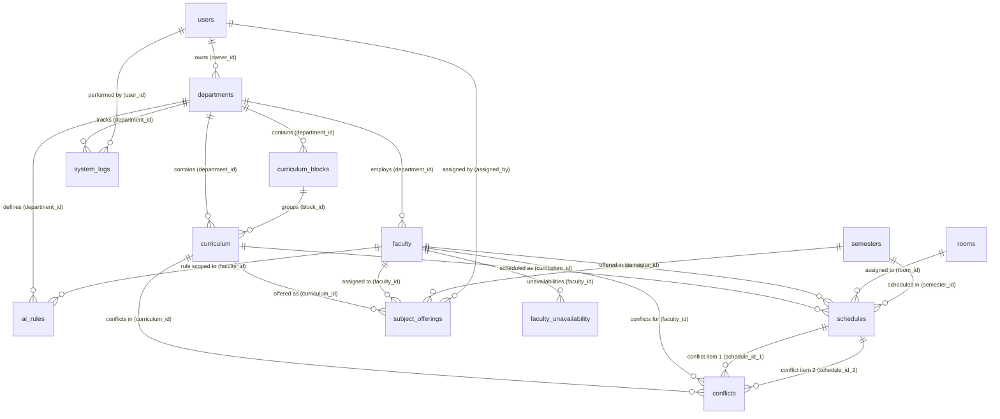

# Database Documentation & Entity-Relationship Schema — ATLAS

**Academic Timetabling System (De La Salle Araneta University - Tertiary Education)**

---

## 1. Overview & Connection Architecture

ATLAS utilizes **SQLAlchemy 2.0 ORM** for database interaction. The system is designed for multi-environment compatibility:
- **Local / Development**: Embedded **SQLite** database stored at `backend/atlas_v3.db`.
- **Production**: Relational **PostgreSQL** database specified via `DATABASE_URL` environment variable.

The database initialization routine (`init_db()` in `backend/main.py`) handles schema migrations automatically on startup without data loss.

> [!IMPORTANT]
> **User Accounts vs. Faculty Records**:
> - The `users` table stores authenticated system user accounts (`admin`, `program_chair`, `coordinator`).
> - The `faculty` table stores faculty member profiles used purely as scheduling resource records (workload caps, subject capabilities, unavailability slots) managed by authorized system users. Faculty members do not log into the system.

---

## 2. Entity-Relationship Diagram (ERD)

---

## 3. Detailed Table Schemas

### 3.1 `users`
Stores user authentication records, profile metadata, and security tokens for authenticated system user roles.

| Column | Type | Constraints / Modifiers | Description |
| :--- | :--- | :--- | :--- |
| `id` | `INTEGER` | `PRIMARY KEY`, `AUTOINCREMENT` | Unique user identifier |
| `first_name` | `VARCHAR(255)` | `NOT NULL` | First name |
| `last_name` | `VARCHAR(255)` | `NOT NULL` | Last name |
| `contact_number`| `VARCHAR(20)` | `NULLABLE` | Phone number |
| `email` | `VARCHAR(255)` | `NOT NULL`, `UNIQUE`, `INDEX` | User email address (login username) |
| `password_hash` | `VARCHAR(255)` | `NOT NULL` | Bcrypt hashed password |
| `role` | `VARCHAR(50)` | `NOT NULL`, `DEFAULT 'program_chair'`| Authenticated role (`admin`, `program_chair`, `coordinator`) |
| `department` | `VARCHAR(50)` | `NULLABLE` | Assigned department code (CAST, CBMA, CVMAS, COED) |
| `sex` | `ENUM` | `NULLABLE` | `'Male'`, `'Female'`, `'Other'` |
| `date_of_birth` | `DATE` | `NULLABLE` | Date of birth |
| `profile_picture`| `VARCHAR(255)` | `NULLABLE` | Path to uploaded profile image |
| `is_verified` | `BOOLEAN` | `DEFAULT False` | Account email verification status |
| `verification_otp`| `VARCHAR(10)` | `NULLABLE` | Account verification OTP code |
| `reset_otp` | `VARCHAR(10)` | `NULLABLE` | Password reset OTP code |
| `reset_otp_expiry`| `DATETIME` | `NULLABLE` | Expiration timestamp for reset OTP |
| `session_version`| `INTEGER` | `DEFAULT 1` | Invalidation version for active JWT sessions |
| `created_at` | `DATETIME` | `DEFAULT UTC` | Record creation timestamp |
| `updated_at` | `DATETIME` | `DEFAULT UTC` | Last update timestamp |

---

### 3.2 `departments`
University academic departments / colleges.

| Column | Type | Constraints / Modifiers | Description |
| :--- | :--- | :--- | :--- |
| `id` | `INTEGER` | `PRIMARY KEY` | Department ID |
| `name` | `VARCHAR(255)` | `NOT NULL` | Full department name (e.g. College of Arts, Sciences, and Technology) |
| `code` | `VARCHAR(50)` | `NOT NULL`, `UNIQUE` | Department short code (`CAST`, `CBMA`, `CVMAS`, `COED`) |
| `description` | `VARCHAR(500)` | `NULLABLE` | Department description |
| `owner_id` | `INTEGER` | `FOREIGN KEY(users.id ON DELETE CASCADE)` | Department owner / Program Chair user ID |

---

### 3.3 `curriculum_blocks`
Isolated curriculum blocks created per Excel import file.

| Column | Type | Constraints / Modifiers | Description |
| :--- | :--- | :--- | :--- |
| `id` | `INTEGER` | `PRIMARY KEY` | Block ID |
| `program_name` | `VARCHAR(255)` | `NOT NULL` | Program name (e.g. BACHELOR OF SCIENCE IN COMPUTER SCIENCE) |
| `academic_year` | `VARCHAR(50)` | `NOT NULL` | Academic year (e.g. AY 2026) |
| `filename` | `VARCHAR(255)` | `NULLABLE` | Original uploaded Excel filename |
| `department_id` | `INTEGER` | `FOREIGN KEY(departments.id ON DELETE CASCADE)` | Owning department ID |
| `status` | `VARCHAR(20)` | `DEFAULT 'PUBLISHED'` | Status (`DRAFT`, `PUBLISHED`, `ARCHIVED`) |
| `created_at` | `DATETIME` | `DEFAULT UTC` | Block import timestamp |

---

### 3.4 `curriculum`
Individual subject courses within curriculum blocks.

| Column | Type | Constraints / Modifiers | Description |
| :--- | :--- | :--- | :--- |
| `id` | `INTEGER` | `PRIMARY KEY` | Subject ID |
| `block_id` | `INTEGER` | `FOREIGN KEY(curriculum_blocks.id ON DELETE CASCADE)` | Owning curriculum block ID |
| `code` | `VARCHAR(50)` | `NOT NULL` | Course code (e.g. CS101, GE101) |
| `name` | `VARCHAR(255)` | `NOT NULL` | Course title / name |
| `units` | `INTEGER` | `NOT NULL` | Total credit units |
| `department_id` | `INTEGER` | `FOREIGN KEY(departments.id ON DELETE CASCADE)` | Department ID |
| `type` | `ENUM` | `NOT NULL` | Subject classification (`'lecture'`, `'lab'`) |
| `program_code` | `VARCHAR(50)` | `NULLABLE` | Program code identifier |
| `year_level` | `VARCHAR(20)` | `NULLABLE` | Year level (`1st Year`, `2nd Year`, etc.) |
| `semester_term`| `VARCHAR(20)` | `NULLABLE` | Term designation (`1st Term`, `2nd Term`) |
| `lec_units` | `INTEGER` | `DEFAULT 0` | Lecture units portion |
| `lab_units` | `INTEGER` | `DEFAULT 0` | Laboratory units portion |
| `pre_requisite` | `VARCHAR(100)` | `NULLABLE` | Prerequisite course codes |
| `is_major` | `BOOLEAN` | `DEFAULT True` | Major vs minor subject flag |

---

### 3.5 `rooms`
Physical spaces available for scheduling.

| Column | Type | Constraints / Modifiers | Description |
| :--- | :--- | :--- | :--- |
| `id` | `INTEGER` | `PRIMARY KEY` | Room ID |
| `name` | `VARCHAR(100)` | `NOT NULL` | Room designation (e.g. Lab 2, Rm 301) |
| `building` | `VARCHAR(100)` | `NOT NULL` | Building name / location |
| `capacity` | `INTEGER` | `NOT NULL` | Seating / student capacity |
| `type` | `ENUM` | `NOT NULL` | Room category (`'lecture'`, `'lab'`, `'computer_lab'`) |

---

### 3.6 `faculty`
Faculty member teaching records (resource profiles managed by Program Chairs/Coordinators).

| Column | Type | Constraints / Modifiers | Description |
| :--- | :--- | :--- | :--- |
| `id` | `INTEGER` | `PRIMARY KEY` | Faculty Record ID |
| `first_name` | `VARCHAR(255)` | `NOT NULL`, `DEFAULT ''` | First name |
| `last_name` | `VARCHAR(255)` | `NOT NULL`, `DEFAULT ''` | Last name |
| `email` | `VARCHAR(255)` | `NULLABLE` | Faculty contact email |
| `contact_number`| `VARCHAR(20)` | `NULLABLE` | Phone number |
| `max_units` | `INTEGER` | `NOT NULL`, `DEFAULT 18` | Maximum allowable teaching units (Workload Cap) |
| `type` | `ENUM` | `NOT NULL`, `DEFAULT 'full_time'`| Employment type (`'full_time'`, `'part_time'`) |
| `department_id` | `INTEGER` | `FOREIGN KEY(departments.id ON DELETE CASCADE)` | Department ID |

---

### 3.7 `faculty_unavailability`
Time slots when a specific faculty record is unavailable to teach.

| Column | Type | Constraints / Modifiers | Description |
| :--- | :--- | :--- | :--- |
| `id` | `INTEGER` | `PRIMARY KEY` | Record ID |
| `faculty_id` | `INTEGER` | `FOREIGN KEY(faculty.id ON DELETE CASCADE)`, `INDEX` | Faculty Record ID |
| `day_of_week` | `ENUM` | `NOT NULL` | Day (`'Mon'`, `'Tue'`, `'Wed'`, `'Thu'`, `'Fri'`, `'Sat'`) |
| `start_time` | `TIME` | `NOT NULL` | Start time boundary |
| `end_time` | `TIME` | `NOT NULL` | End time boundary |
| `created_at` | `DATETIME` | `DEFAULT UTC` | Record timestamp |

---

### 3.8 `semesters`
Academic year and term periods.

| Column | Type | Constraints / Modifiers | Description |
| :--- | :--- | :--- | :--- |
| `id` | `INTEGER` | `PRIMARY KEY` | Semester ID |
| `academic_year` | `VARCHAR(20)` | `NOT NULL` | Academic year (e.g. 2025-2026) |
| `term` | `ENUM` | `NOT NULL` | Term (`'1st'`, `'2nd'`, `'3rd semester'`) |
| `is_active` | `BOOLEAN` | `DEFAULT False` | Flag for currently active semester |

---

### 3.9 `subject_offerings`
Assignments mapping Faculty records to Curriculum subjects for a specific Semester.

| Column | Type | Constraints / Modifiers | Description |
| :--- | :--- | :--- | :--- |
| `id` | `INTEGER` | `PRIMARY KEY` | Offering ID |
| `faculty_id` | `INTEGER` | `FOREIGN KEY(faculty.id ON DELETE CASCADE)` | Assigned faculty record ID |
| `curriculum_id` | `INTEGER` | `FOREIGN KEY(curriculum.id ON DELETE CASCADE)` | Target subject ID |
| `semester_id` | `INTEGER` | `FOREIGN KEY(semesters.id ON DELETE CASCADE)` | Active semester ID |
| `assigned_by` | `INTEGER` | `FOREIGN KEY(users.id ON DELETE SET NULL)` | Authorized user ID (Admin/Chair/Coordinator) who made assignment |
| `created_at` | `DATETIME` | `DEFAULT UTC` | Creation timestamp |

---

### 3.10 `schedules`
Generated class timetables.

| Column | Type | Constraints / Modifiers | Description |
| :--- | :--- | :--- | :--- |
| `id` | `INTEGER` | `PRIMARY KEY` | Schedule ID |
| `semester_id` | `INTEGER` | `FOREIGN KEY(semesters.id)`, `INDEX` | Semester ID |
| `curriculum_id` | `INTEGER` | `FOREIGN KEY(curriculum.id ON DELETE CASCADE)` | Curriculum subject ID |
| `faculty_id` | `INTEGER` | `FOREIGN KEY(faculty.id ON DELETE CASCADE)`, `INDEX` | Faculty record ID |
| `room_id` | `INTEGER` | `FOREIGN KEY(rooms.id)`, `INDEX`, `NULLABLE` | Room ID (`NULL` for lecture subjects) |
| `day_of_week` | `ENUM` | `INDEX` | Scheduled day (`Mon`, `Tue`, `Wed`, `Thu`, `Fri`, `Sat`) |
| `start_time` | `TIME` | `INDEX` | Class start time |
| `end_time` | `TIME` | `INDEX` | Class end time |
| `section` | `VARCHAR(20)` | `NULLABLE` | Class section string |
| `status` | `ENUM` | `DEFAULT 'draft'` | Status (`'draft'`, `'published'`) |
| `is_locked` | `BOOLEAN` | `DEFAULT False` | Lock state against regenerations |
| `created_at` | `DATETIME` | `DEFAULT UTC` | Creation timestamp |
| `updated_at` | `DATETIME` | `DEFAULT UTC` | Last update timestamp |

---

### 3.11 `conflicts`
Unresolved scheduling constraints logged by the generator or manual actions.

| Column | Type | Constraints / Modifiers | Description |
| :--- | :--- | :--- | :--- |
| `id` | `INTEGER` | `PRIMARY KEY` | Conflict ID |
| `schedule_id_1` | `INTEGER` | `FOREIGN KEY(schedules.id ON DELETE CASCADE)` | First schedule item |
| `schedule_id_2` | `INTEGER` | `FOREIGN KEY(schedules.id ON DELETE CASCADE)` | Second schedule item |
| `faculty_id` | `INTEGER` | `FOREIGN KEY(faculty.id ON DELETE CASCADE)` | Related faculty record ID |
| `curriculum_id` | `INTEGER` | `FOREIGN KEY(curriculum.id ON DELETE CASCADE)` | Related subject ID |
| `conflict_type` | `VARCHAR(50)` | `NULLABLE` | Category (`max_units_exceeded`, `unplaced_lab`, etc.) |
| `reason` | `VARCHAR(500)` | `NULLABLE` | Human readable conflict rationale |
| `resolved_at` | `DATETIME` | `NULLABLE` | Resolution timestamp (`NULL` if unresolved) |
| `created_at` | `DATETIME` | `DEFAULT UTC` | Conflict logging timestamp |

---

### 3.12 `system_logs`
Audit logs recording operational actions across the application.

| Column | Type | Constraints / Modifiers | Description |
| :--- | :--- | :--- | :--- |
| `id` | `INTEGER` | `PRIMARY KEY` | Log ID |
| `user_id` | `INTEGER` | `FOREIGN KEY(users.id ON DELETE SET NULL)` | Authorized user ID |
| `department_id` | `INTEGER` | `FOREIGN KEY(departments.id)` | Department context ID |
| `action` | `VARCHAR(255)` | `NOT NULL` | Action title (e.g. "Generate Schedule", "Upload Curriculum") |
| `details` | `VARCHAR(1000)`| `NULLABLE` | Detailed description of action |
| `status` | `ENUM` | `DEFAULT 'success'` | Result status (`'success'`, `'warning'`, `'error'`) |
| `timestamp` | `DATETIME` | `DEFAULT UTC` | Event timestamp |

---

### 3.13 `ai_rules`
Custom scheduling rule preferences per department or faculty record.

| Column | Type | Constraints / Modifiers | Description |
| :--- | :--- | :--- | :--- |
| `id` | `INTEGER` | `PRIMARY KEY` | Rule ID |
| `department_id` | `INTEGER` | `FOREIGN KEY(departments.id ON DELETE CASCADE)` | Department ID |
| `faculty_id` | `INTEGER` | `FOREIGN KEY(faculty.id ON DELETE CASCADE)` | Target faculty record ID |
| `rule_type` | `VARCHAR(100)` | `NOT NULL` | Rule category (`preferred_time`, `max_consecutive_hours`) |
| `rule_value` | `VARCHAR(500)` | `NOT NULL` | JSON string or rule payload |
| `is_active` | `BOOLEAN` | `DEFAULT True` | Active state flag |
| `created_at` | `DATETIME` | `DEFAULT UTC` | Creation timestamp |
