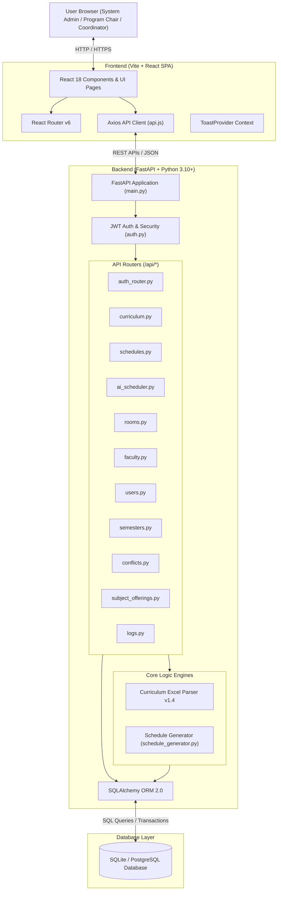
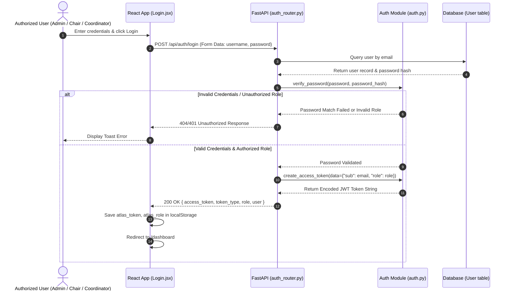
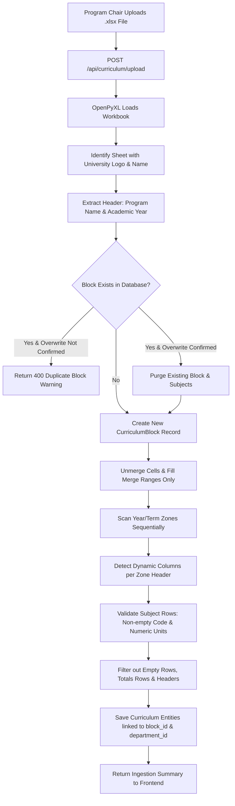

# System Architecture & Technical Design — ATLAS

**Academic Timetabling System (De La Salle Araneta University - Tertiary Education)**

---

## 1. Executive Summary & System Overview

**ATLAS** (Academic Timetabling System) is a specialized, web-based automated class schedule generation and curriculum management platform developed specifically for De La Salle Araneta University (DLSAU) Tertiary Education. It caters strictly to three authorized user roles:
1. **System Administrator** (`admin`)
2. **Program Chair** (`program_chair`)
3. **Coordinator** (`coordinator`)

Across university academic departments:
- **CAST** (College of Arts, Sciences, and Technology)
- **CBMA** (College of Business Management and Accountancy)
- **CVMAS** (College of Veterinary Medicine and Agricultural Sciences)
- **COED** (College of Education)

> [!IMPORTANT]
> **User Scope**: Only System Administrators, Program Chairs, and Coordinators are authenticated users who log into and interact with ATLAS. Faculty members do not access or log into the system; faculty records are managed as scheduling resources (teaching unit limits, unavailability slots, subject qualifications) by authorized Program Chairs and Coordinators.

ATLAS replaces manual, error-prone timetabling spreadsheets with an algorithmic constraint-satisfaction engine, dynamic visual schedule calendars, automated Excel curriculum ingestion with block isolation, multi-department role-based access control (RBAC), and publication export capabilities (PDF/Excel).

---

## 2. High-Level System Architecture

ATLAS follows a modern decoupled architecture comprising a single-page application (SPA) frontend, a high-performance RESTful Python backend, and a relational database layer supporting both SQLite (local development) and PostgreSQL (production).



---

## 3. Technology Stack

### Frontend
- **Framework**: React 18 with Vite (Ultra-fast build system & HMR)
- **Styling**: Vanilla CSS + Tailwind CSS (Utility classes & custom dark/light theme variables)
- **Icons**: Lucide React (`lucide-react`)
- **HTTP Client**: Axios with request/response interceptors for automatic JWT bearer token handling
- **Routing**: React Router DOM (`react-router-dom` v6)
- **Export Engines**: HTML-to-Canvas (`html2canvas`) and `jspdf` for visual schedule PDF export

### Backend
- **Framework**: FastAPI (Python 3.10+)
- **ASGI Server**: Uvicorn (`uvicorn`)
- **ORM & Database Toolkit**: SQLAlchemy 2.0 (`sqlalchemy`)
- **Excel Ingestion**: OpenPyXL (`openpyxl`)
- **Data Validation**: Pydantic v2 (`pydantic`)
- **Security & Hashing**: Passlib with Bcrypt (`passlib[bcrypt]`), PyJWT (`pyjwt`), Python-Multipart (`python-multipart`)
- **Environment Management**: `python-dotenv`

### Database
- **Local Development**: SQLite (`backend/atlas_v3.db`) with auto-migration scripts
- **Production**: PostgreSQL (Managed via Vercel / Render / Supabase / Neon)

---

## 4. Component Breakdown & Data Flow

### 4.1 Authentication & Session Handling Flow

ATLAS utilizes JSON Web Tokens (JWT) for stateless authentication of System Administrators, Program Chairs, and Coordinators.



### 4.2 Curriculum Ingestion (v1.4 Block Isolation Engine)

Curriculum parsing ingests `.xlsx` files uploaded by Program Chairs or Admins.



### 4.3 Automated AI Schedule Generation Engine

The scheduling service (`schedule_generator.py`) operates via a constraint-satisfaction heuristic algorithm.

```mermaid
flowchart TD
    A[Program Chair / Coordinator clicks 'Generate Schedule'] --> B[POST /api/ai-scheduler/generate/{semester_id}]
    B --> C[Verify Active Semester & Dept Permission]
    C --> D[Purge Previous Unlocked Draft Schedules & Unresolved Conflicts for Selected Faculty Records]
    D --> E[Fetch Subject Offerings for Department & Active Semester]
    E --> F[Load Faculty Workload Limits & Faculty Unavailability Slots]
    F --> G[Load Rooms Grouped by Type: lecture vs lab/computer_lab]
    
    G --> H[Loop Through Subject Offerings]
    H --> I{Subject Type?}
    
    I -- Lecture --> J[Test Day Pairs: MW, TTh, FS across LECTURE_SLOTS]
    J --> K[Check Faculty Unavailability & Schedule Overlaps]
    K --> L{Valid Slot Found?}
    L -- Yes --> M[Create Draft Schedule Record: room_id = NULL]
    L -- No --> N[Record Conflict: unplaced_lecture]
    
    I -- Laboratory --> O[Test Day Pairs across LAB_SLOTS]
    O --> P[Filter Valid Lab Rooms: type in lab, computer_lab]
    P --> Q[Check Faculty Record & Room Conflicts]
    Q --> R{Valid Room + Slot Found?}
    R -- Yes --> S[Create Draft Schedule Record: room_id = Room.id]
    R -- No --> T[Record Conflict: unplaced_lab / no_lab_room_available]
    
    M --> U[Update Faculty Teaching Hours Used]
    S --> U
    N --> V[Commit Pending Schedules & Conflicts to DB]
    T --> V
    U --> V
    V --> W[Return Generation Summary & Workload Warnings]
```

---

## 5. Role-Based Access Control (RBAC) Matrix

ATLAS enforces RBAC both on the backend (FastAPI dependency injection via `Depends(auth.get_current_user)`) and on the frontend (React `ProtectedRoute` wrappers).

The system supports exactly **three authenticated user roles**:

| Feature / Endpoint Group | System Administrator (`admin`) | Program Chair (`program_chair`) | Coordinator (`coordinator`) |
| :--- | :---: | :---: | :---: |
| **System Dashboard Overview** | ✅ Full System Overview | ✅ Department Overview | ✅ Department Overview |
| **User Account Management (`/api/users/*`)** | ✅ Full Control | ❌ Restricted | ❌ Restricted |
| **Academic Semesters (`/api/semesters/*`)** | ✅ Full (Add, Activate) | 👁️ Read Active Semester | 👁️ Read Active Semester |
| **Curriculum Ingestion & CRUD (`/api/curriculum/*`)** | ✅ Full | ✅ Department Curriculum | ✅ Department Curriculum |
| **Room Management (`/api/rooms/*`)** | ✅ Full | ✅ Department Rooms | ✅ Department Rooms |
| **Faculty Record Management (`/api/faculty/*`)** | ✅ Full | ✅ Department Faculty Records | ✅ Department Faculty Records |
| **Subject Offering Assignment (`/api/subject-offerings/*`)** | ✅ Full | ✅ Department Assignments | ✅ Department Assignments |
| **AI Schedule Generator (`/api/ai-scheduler/*`)** | ✅ Full | ✅ Department Execution | ✅ Department Execution |
| **Conflict Resolution Panel (`/api/conflicts/*`)** | ✅ Full | ✅ Department Conflicts | ✅ Department Conflicts |
| **Schedule Lock & Publish (`/api/schedules/*`)** | ✅ Full | ✅ Department Schedules | ✅ Department Schedules |
| **Export Schedules (PDF / Excel)** | ✅ Full | ✅ Full | ✅ Full |
| **System Audit Logs (`/api/logs/*`)** | ✅ All System Logs | ✅ Dept Activity Logs | ✅ Dept Activity Logs |

---

## 6. Error Handling & Security Architecture

1. **Global Exception Handler**: FastAPI traps unhandled runtime exceptions (`backend/main.py`), returning clean JSON responses with standard status codes (400, 401, 403, 404, 422, 500). In production (`ENV=production`), detailed exception tracebacks are suppressed from API responses to prevent information leakage.
2. **CORS Security**: Cross-Origin Resource Sharing is strictly constrained to configured origins (`ALLOWED_ORIGINS` environment variable) and standard localhost ports (`5173`, `5174`, `3000`), with wildcard regex matching for production Vercel previews (`https://.*\.vercel\.app`).
3. **Database Migration Safety**: The database initializer (`init_db()`) inspects table schemas on application startup using native database PRAGMA queries (SQLite) or `ALTER TABLE` DDL queries (PostgreSQL), safely adding missing columns without dropping data.
